# Чек-листы ads.vk.com

## Горизонтальное меню

Ссылка на страницу: https://ads.vk.ru/

- При нажатии на `Перейти в кабинет` происходит переход на страницу
  регистрации [VK ID](https://id.vk.ru/auth?app_id=8064163&response_type=silent_token&v=1.61.1&redirect_uri=https%3A%2F%2Fads.vk.ru%2Fapi%2Fcallbacks%2Fvkconnect-complete&uuid=6WtUCgREf1QS5bq3BXYk1&redirect_state=%257B%2522redirect_url%2522%253A%2522https%253A%252F%252Fads.vk.ru%252Fhq%253Fref%253Dmain_landing%2522%257D)
- При нажатии на  `Справка` происходит переход на страницу c информацией https://ads.vk.ru/help
- При нажатии на  `Новости` происходит переход на страницу новостей https://ads.vk.ru/news
- При нажатии на  `Кейсы` происходит переход на страницу с кейсами https://ads.vk.ru/cases
- При нажатии на  `Форум идей` происходит переход на форум https://ads.vk.ru/upvote
- При нажатии на  `Монетизация` происходит переход на форум https://ads.vk.ru/partner

## Главная страница (для неавторизованных пользователей)

Ссылка на страницу: https://ads.vk.ru/

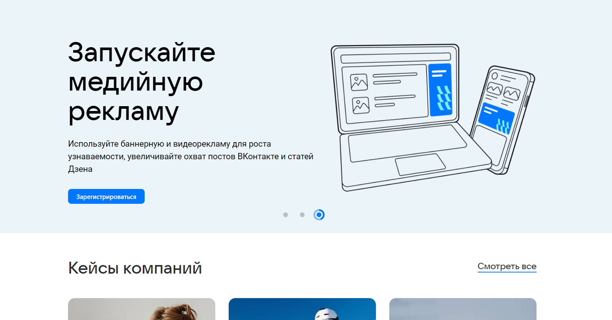

- При нажатии на `Смотреть все` происходит переход на страницу `Кейсы` https://ads.vk.ru/cases
- Отрисовывается карусель из 3-х элементов
- Каждый элемент карусели содержит: фото, заголовок, подзаголовок, кнопка (приведены на фото со слайдами)

| Слайд 1                        | Слайд 2                        | Слайд 3                        |
|--------------------------------|--------------------------------|--------------------------------|
| 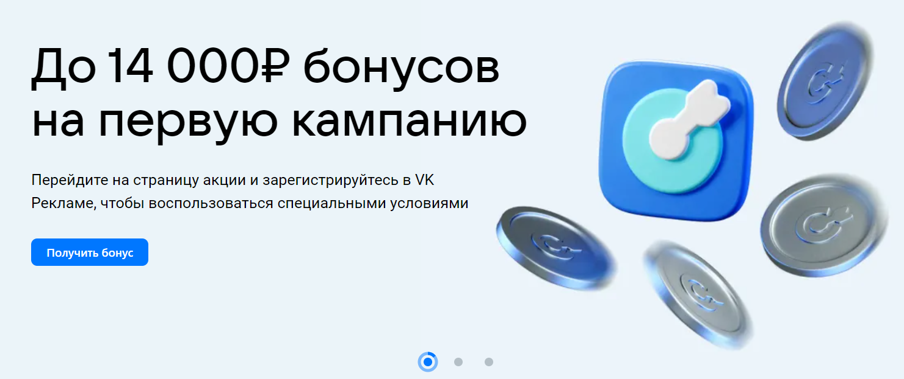 | 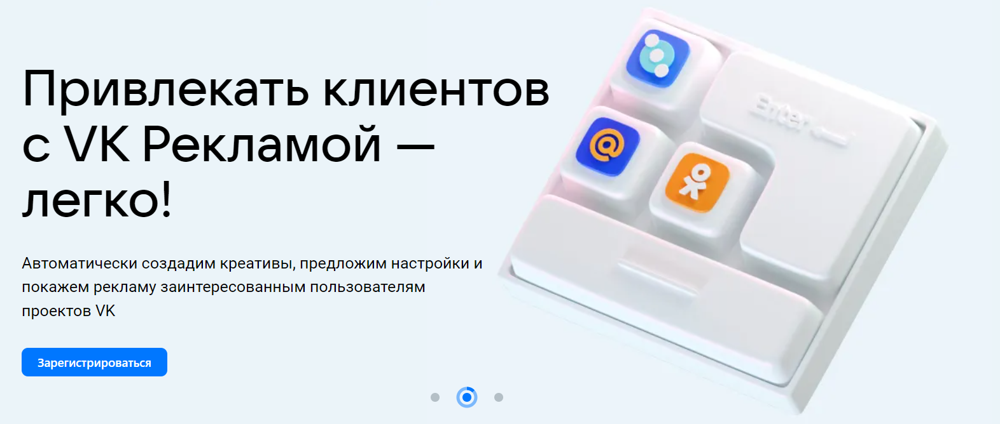 | 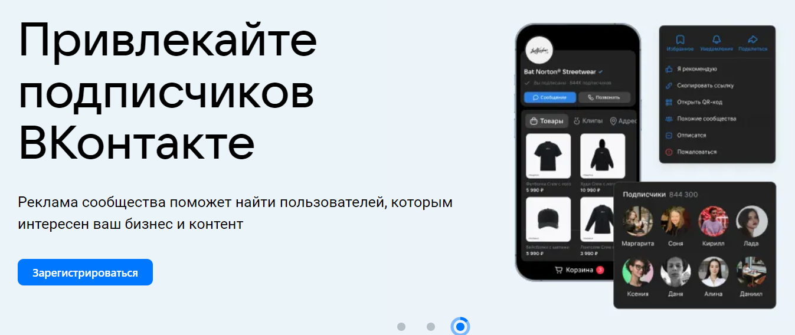 |

- При нажатии на `Зарегистрироваться` происходит переход на страницу
  регистрации [VK ID](https://id.vk.ru/auth?app_id=8064163&response_type=silent_token&v=1.61.1&redirect_uri=https%3A%2F%2Fads.vk.ru%2Fapi%2Fcallbacks%2Fvkconnect-complete&uuid=6WtUCgREf1QS5bq3BXYk1&redirect_state=%257B%2522redirect_url%2522%253A%2522https%253A%252F%252Fads.vk.ru%252Fhq%253Fref%253Dmain_landing%2522%257D)
- При нажатии на `Получить бонус` происходит переход на страницу https://ads.vk.ru/promo/firstbonus
- Отрисовывается заголовок `Обучающие вебинары`,
  подзаголовок `Эксперты VK и наши партнеры рассказывают, как эффективно использовать технологии VK Рекламы` и
  кнопка `Подробнее`

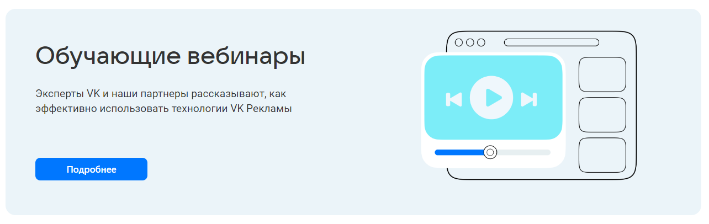

- При нажатии на `Подробнее` происходит переход на страницу `Обучение` https://ads.vk.ru/cases

- Отрисовывается заголовок `Составляйте портрет аудитории сайта в VK Рекламе` и кнопка `Подробнее`

- При нажатии на `Подробнее` происходит переход на страницу `Новости` https://ads.vk.ru/cases

## Страница: Монетизация (для неавторизованных пользователей)

Ссылка на страницу: https://ads.vk.ru/partner

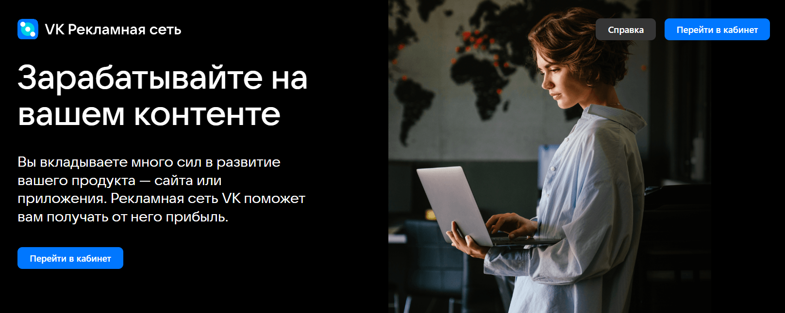

- Отрисовывается заголовок `Зарабатывайте на вашем контенте`,
  подзаголовок `Вы вкладываете много сил в развитие вашего продукта — сайта или приложения. Рекламная сеть VK поможет вам получать от него прибыль.`
  и кнопка `Перейти в кабинет`
- При нажатии на `Перейти в кабинет` происходит переход на страницу
  регистрации [VK ID](https://id.vk.ru/auth?app_id=8064163&response_type=silent_token&v=1.61.1&redirect_uri=https%3A%2F%2Fads.vk.ru%2Fapi%2Fcallbacks%2Fvkconnect-complete&uuid=6WtUCgREf1QS5bq3BXYk1&redirect_state=%257B%2522redirect_url%2522%253A%2522https%253A%252F%252Fads.vk.ru%252Fhq%253Fref%253Dmain_landing%2522%257D)
- При нажатии на  `Справка` происходит переход на страницу c информацией https://ads.vk.ru/help
- Отрисовывается заголовок `Развивайте бизнес с технологиями VK`,
  подзаголовок `Добавьте рекламные блоки на ваш сайт или в приложение`
- На странице расположен слайдер из 4-х элементов

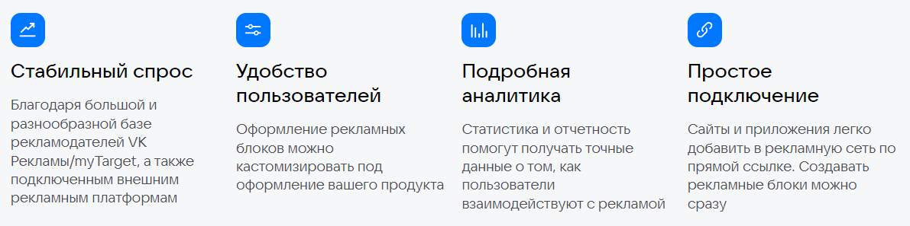

- Отрисовывается подзаголовок `Используйте подходящие вам форматы` и переключатель с двумя режимами:

| Для сайтов                      | Для прилодений                     |
|---------------------------------|------------------------------------|
| 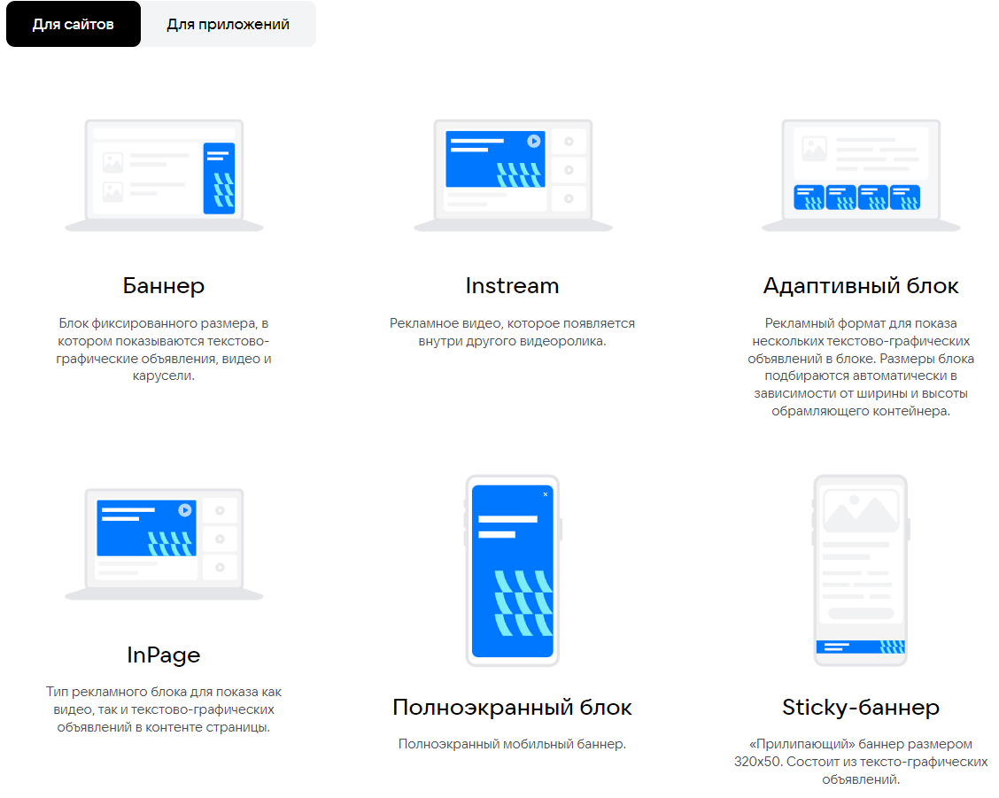 | 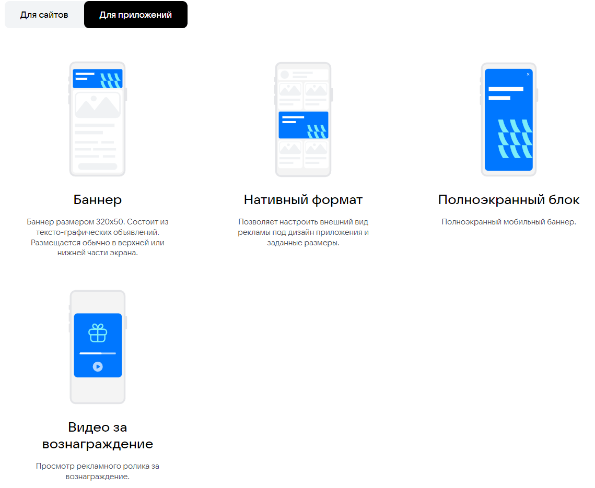 |

- При нажатии на `Перейти в кабинет` происходит переход на страницу
  регистрации [VK ID](https://id.vk.ru/auth?app_id=8064163&response_type=silent_token&v=1.61.1&redirect_uri=https%3A%2F%2Fads.vk.ru%2Fapi%2Fcallbacks%2Fvkconnect-complete&uuid=6WtUCgREf1QS5bq3BXYk1&redirect_state=%257B%2522redirect_url%2522%253A%2522https%253A%252F%252Fads.vk.ru%252Fhq%253Fref%253Dmain_landing%2522%257D)

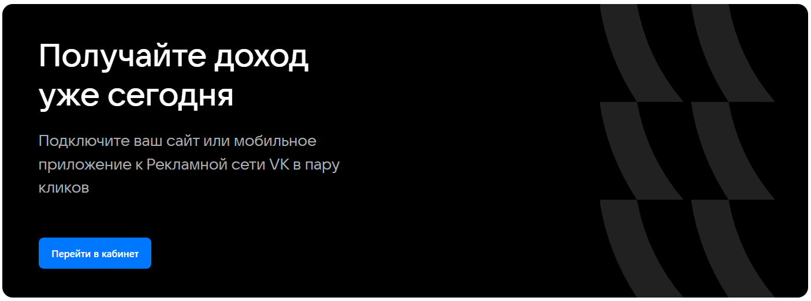

### Форма обратной связи (для неавторизованных пользователей)

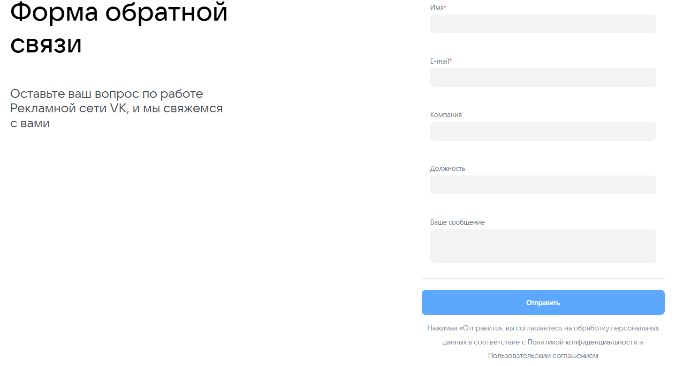

- Отрисовывается заголовок `Форма обратной связи`,
  подзаголовок `Оставьте ваш вопрос по работе Рекламной сети VK, и мы свяжемся с вами`
- Отрисовываются подписи: `Имя*`, `E-mail*`, `Компания`, `Должность`, `Ваше сообщение` и поля ввода для каждого
- Отрисовывается кнопка `Отправить` и подпись к
  ней `Нажимая «Отправить», вы соглашаетесь на обработку персональных данных в соответствие с Политикой конфиденциальности и Пользовательским соглашением`
- При нажатии `Отправить`, если заполнены обязательные поля, форма исчезает и появляется текст:

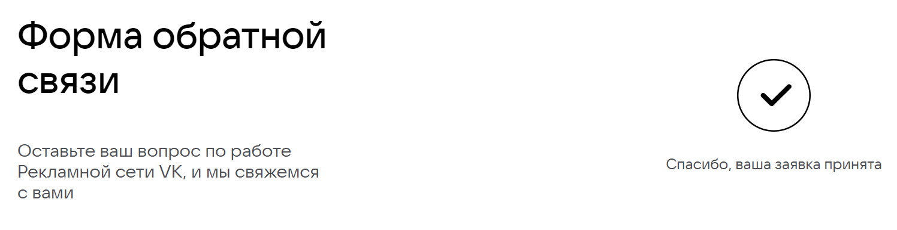

- При нажатии `Отправить`, если не заполнено поле `E-mail`, ничего не происходит
- При нажатии `Отправить`, если не заполнено поле `Имя`, ничего не происходит

## Страница: Форум идей (для неавторизованных пользователей)

Ссылка на страницу: https://ads.vk.ru/upvote

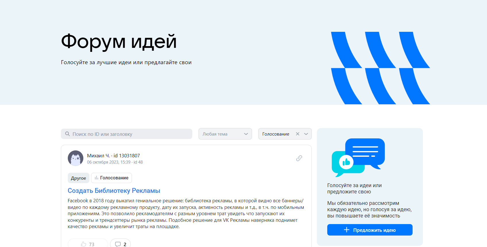

- Отрисовывается заголовок `Форум идей`, подзаголовок `Голосуйте за лучшие идеи или предлагайте свои`

### Предложить идею

- Отрисовывается
  текст `Голосуйте за идеи или предложите свою Мы обязательно рассмотрим каждую идею, но голосуя за идею, вы повышаете её значимость`
  и кнопка `Предложить идею`
- При нажатии `Предложить идею` появляется всплывающиее окно

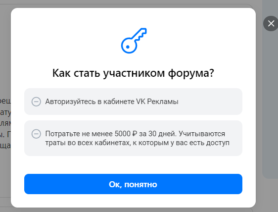

- При нажатии `X` или `Ок, понятно` всплывающиее окно закрывается

### Фильтры

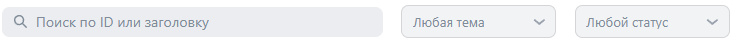

- Отрисовывается инпут placeholder - `Поиск по ID или заголовку`
- Отрисовывается выпадающий список - `Любая тема` содержащий следующие элементы:
    - Лидформы
    - Сообщества
    - Форум идей
    - Сайты
    - Каталог товаров
    - Мобильные приложения
    - Другое
- Отрисовывается выпадающий список - `Любой статус` содержащий следующие элементы:
    - Голосование
    - Уже в работе
    - Реализована
    - Отклонено
- Если при использовании `Поиск по ID или заголовку` результат отсутствует, то повляется заглушка `Не нашлось идей`

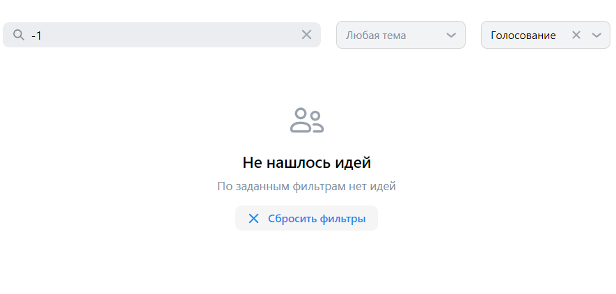

- При нажатии `Сбросить фильтры`, фильтры сбрасываются

### Карточка идеи

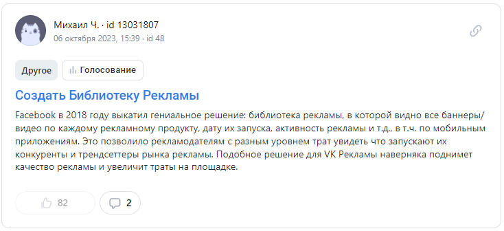

- Содержит следующие элементы:
    - фото автора
    - имя и id автора
    - дата, время создания идеи и id идеи
    - Кнопка: Скопировать ссылку на идею, при нажатии на которую, копируется ссылку на
      идею https://ads.vk.com/upvote/{id}, где id = id идеи
    - тема и статус идеи
    - ссылка с названием идеи, ведущая на страницу идеи https://ads.vk.com/upvote/{id}
    - текст идеи
    - кнопка голосования, при наведении на которую появляется текст `Для голосования необходимо авторизироваться`
    - кнопка комментариев, при нажатии на которую открываются комментарии
    - 
    - Поле ввода текста, placeholder - `Написание комментариев недоступно`
  
