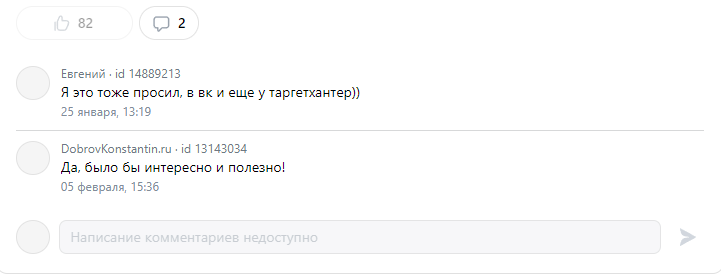

### Чек-листы ads.vk.com

## Создание кампании

### ШАГ 1. Настройка кампании

**Ссылка на страницу:** [https://ads.vk.com/hq/new_create/ad_plan](https://ads.vk.com/hq/new_create/ad_plan)

**Шаги и позитивные проверки:**

1. **Переход на страницу настройки кампании**
    - Перейти на страницу [https://ads.vk.com/hq/new_create/ad_plan](https://ads.vk.com/hq/new_create/ad_plan).

2. **Выбор типа рекламы `Сайт`**
    - Нажать на кнопку `Сайт`.

    

    - Убедиться, что появляется дополнительная форма с полями:
        - `Рекламируемый сайт`
        - `Целевое действие`
        - `Оптимизация бюджета кампании`
        - `Дата`

    

3. **Заполнение полей и переход на ШАГ 2 (без оптимизации бюджета кампании)**
    - Ввести в поле `Рекламируемый сайт` URL: `https://example.com`.
    - Выбрать `Целевое действие` из выпадающего списка: `Клики по рекламе`.
    - Отключить `Оптимизация бюджета кампании`.
    - Выбрать дату в календаре (актуальный день).
    - Нажать кнопку `Продолжить`.
    - Убедиться, что происходит переход на ШАГ 2 настройки кампании.

4. **Заполнение полей и переход на ШАГ 2 (с оптимизацией бюджета кампании)**
    - Ввести в поле `Рекламируемый сайт` URL: `https://example.com`.
    - Выбрать `Целевое действие` из выпадающего списка: `Клики по рекламе`.
    - Включить `Оптимизация бюджета кампании`.
    - Выбрать `Стратегия ставок` из выпадающего списка: `Минимальная цена`.
    - Ввести в поле `Бюджет кампании` значение `100`.
    - Выбрать период: `за день`.
    - Выбрать дату в календаре.
    - Нажать кнопку `Продолжить`.
    - Убедиться, что происходит переход на ШАГ 2 настройки кампании.

### ШАГ 2. Группы объявлений

**Ссылка на страницу:** [https://ads.vk.com/hq/new_create/ad_plan/new-site_conversions/ad_group/new-ad-group-form_9](https://ads.vk.com/hq/new_create/ad_plan/new-site_conversions/ad_group/new-ad-group-form_9) (если выполнены действия на шаге 1)

**Шаги и позитивные проверки:**

1. **Переход на страницу создания группы объявлений**
    - Убедиться, что открыта страница с полями для настройки группы объявлений.

    

2. **Выбор региона (широкая аудитория)**
    - Выбрать регион из предложенного списка: `Россия`.
    - Нажать кнопку `Продолжить`.
    - Убедиться, что происходит переход на ШАГ 3 настройки кампании.

3. **Выбор региона (целевая аудитория)**
    - Выбрать регион из предложенного списка: `Луховицы`.
    - Убедиться, что предупреждение `Слишком широкая аудитория` исчезает при сегментации аудитории до менее 500,000 чел.
    - Нажать кнопку `Продолжить`.
    - Убедиться, что происходит переход на ШАГ 3 настройки кампании.

### ШАГ 3. Объявления

**Ссылка на страницу:** [https://ads.vk.com/hq/new_create/ad_plan/new-site_conversions/ad_group/new-ad-group-form_35/ad/new-ad-form_36](https://ads.vk.com/hq/new_create/ad_plan/new-site_conversions/ad_group/new-ad-group-form_35/ad/new-ad-form_36) (если выполнены действия на шаге 2)

**Шаги и позитивные проверки:**

1. **Переход на страницу создания объявления**
    - Убедиться, что открыта страница с полями для создания объявления.

    

2. **Выбор логотипа**
    - Нажать на кнопку выбора логотипа.
    - Убедиться, что открывается модальное окно с возможностью загрузки или выбора логотипа.
    - Выбрать раздел `Созданное нейросетью`.
    - Выбрать первый логотип и убедиться, что он отображается в соответствующем поле.

3. **Замена логотипа**
    - Повторить п. 2 - Выбор логотипа.
    - Нажать на кнопку `Заменить`.
    - Убедиться, что открывается модальное окно с возможностью загрузки или выбора логотипа.
    - Выбрать раздел `Созданное нейросетью`.
    - Выбрать второй логотип и убедиться, что он отображается в соответствующем поле.

4. **Заполнение всех полей и публикация объявления**
    - Ввести заголовок: `Подарок к празднику!`.
    - Ввести короткое описание: `К Новому году подарим яркие и качественные подарки! В наличии на сайте. Успейте купить.`.
    - Ввести длинное описание: `Lorem ipsum dolor sit amet, consectetur adipiscing elit, sed do eiusmod tempor incididunt ut labore et dolore magna aliqua.`.
    - Ввести текст рядом с кнопкой: `Жми!`.
    - Убедиться, что ссылка на сайт == `https://example.com`.
    - Выбрать надпись на кнопке в выпадающем списке: `Перейти`.
    - Загрузить медиафайлы.
        - Нажать `созданное нейросетью`.
        - Выбрать первые 2 изображения.
    - Убедиться, что в разделе `Предпросмотр` заголовок, короткое описание, текст рядом с кнопкой, надпись на кнопке соответствуют введенным ранее.
    - Нажать кнопку `Опубликовать`.
    - Убедиться, что происходит переход на страницу компании.
   
5. **Заполнение только обязательных полей и публикация объявления**
    - Ввести заголовок: `Подарок к празднику!`.
    - Ввести короткое описание: `К Новому году подарим яркие и качественные подарки! В наличии на сайте. Успейте купить.`.
    - Убедиться, что ссылка на сайт == `https://example.com`.
    - Выбрать надпись на кнопке в выпадающем списке: `Перейти`.
    - Загрузить медиафайлы.
        - Нажать `созданное нейросетью`.
        - Выбрать первые 2 изображения.
    - Убедиться, что в разделе `Предпросмотр` заголовок, короткое описание, текст рядом с кнопкой, надпись на кнопке соответствуют введенным ранее.
    - Нажать кнопку `Опубликовать`.
    - Убедиться, что происходит переход на страницу компании.

### Страница Компании

**Ссылка на страницу:** [https://ads.vk.com/hq/dashboard/ad_plans](https://ads.vk.com/hq/dashboard/ad_plans)

**Шаги и позитивные проверки:**

1. **Переход на страницу компании**
    - Убедиться, что открыта страница с таблицей всех созданных кампаний.

    

2. **Проверка данных созданной кампании**
    - Убедиться, что в таблице появилась созданная кампания с корректными данными:
        - Название кампании (`Кампания YYYY-MM-DD`, где дата - текущая).
        - Бюджет == `100`.
        - Целевое действие == `Клики по рекламе`.
    - Нажать `редактировать`.
    - Рекламируемый сайт == `example.com` (домен нашего сайта).
    - Целевое действие == `Клики по рекламе`.
    - Стратегия ставок == `Минимальная цена`.
    - Бюджет == `100 ₽`.
    - Период == `за день`.
    - Даты проведения == `актуальный день`.
    - Регион == `Луховицы`.
    - Заголовок == `Подарок к празднику!`.
    - Короткое описание == `К Новому году подарим яркие и качественные подарки! В наличии на сайте. Успейте купить.`.
    - Длинное описание == `Lorem ipsum dolor sit amet, consectetur adipiscing elit, sed do eiusmod tempor incididunt ut labore et dolore magna aliqua.`.
    - Текст рядом с кнопкой == `Жми!`.
    - Ссылка на сайт == `https://example.com`.
    - Надпись на кнопке == `Перейти`.

4. **Удаление кампании**
    - Выбрать созданную кампанию.
    - Нажать действие `Удалить`.
    - Убедиться, что кампания исчезла из таблицы.

## Страница: Монетизация (для неавторизованных пользователей)

Ссылка на страницу: https://ads.vk.ru/partner

### Форма обратной связи (для неавторизованных пользователей)

- При нажатии `Отправить`, если в поля Имя и E-mail хоть что-то введено, форма исчезает и появляется текст:

- При нажатии `Отправить`, если в поля Имя и E-mail, Компания, Должность, Ваше сообщение  хоть что-то введено, форма исчезает и появляется тот же текст.
- При нажатии `Отправить`, если не заполнено поле `E-mail`, ничего не происходит
- При нажатии `Отправить`, если не заполнено поле `Имя`, ничего не происходит

## Страница: Форум идей (для неавторизованных пользователей)

Ссылка на страницу: https://ads.vk.ru/upvote

### Фильтры

- Если ввести ID в поле `Поиск по ID или заголовку`, то останется только идея с соответствующим ID
- Если ввести заголовок в поле `Поиск по ID или заголовку`, то останется только идея с соответствующим заголовком
- Если выбрать тему, то останутся только идеи с выбранной темой
- Если выбрать статус, то останутся только идеи с выбранным статусом
- Если выбрать статус и тему, то останутся только идеи с выбранным статусом и темой
- Если выбрать статус и написать ID, то останутся только идеи с выбранным статусом и ID
- Если выбрать статус и написать заголовок, то останутся только идеи с выбранным статусом и заголовком
- Если выбрать тему и написать ID, то останутся только идеи с выбранным темой и ID
- Если выбрать тему и написать заголовок, то останутся только идеи с выбранным темой и заголовком
- Если выбрать статус и тему и написать ID, то останутся только идеи с выбранным статусом, темой и ID
- Если выбрать статус и тему и написать заголовок, то останутся только идеи с выбранным статусом, темой и заголовком
- Если при использовании фильтров результат отсутствует, то повляется заглушка `Не нашлось идей`

- При нажатии `Сбросить фильтры`, фильтры сбрасываются, показываются все идеи

### Карточка идеи

- при нажатии скопировать ссылку на идею, копируется ссылку на идею https://ads.vk.com/upvote/{id}, где id = id идеи
- при нажатии на название, открывается страница идеи https://ads.vk.com/upvote/{id}, на которой есть идея с выбранным id
- кнопка комментариев, при нажатии на которую открываются комментарии, количество комментариев равно количеству на счетчике

  
  
